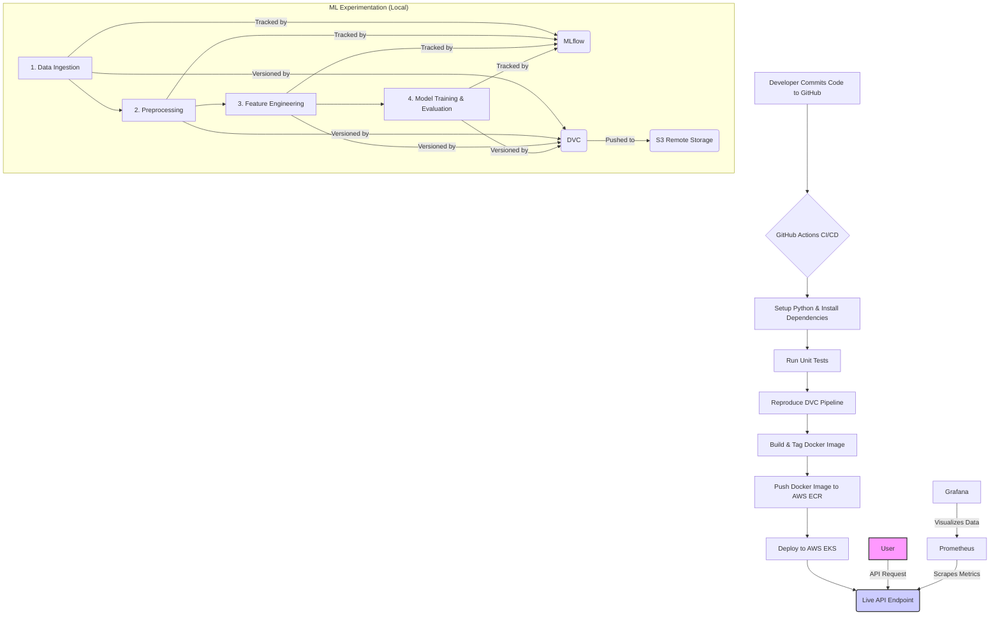

# End-to-End MLOps: Deploying a Machine Learning Model on AWS Kubernetes

This project demonstrates a complete, production-grade MLOps pipeline for training, versioning, containerizing, deploying, and monitoring a machine learning model. The entire workflow is automated using a CI/CD pipeline and deployed on a scalable Kubernetes cluster in AWS.

## 🚀 Project Overview

The core of this project is to build a robust and reproducible system that automatically moves a machine learning model from experimentation to a live, monitored production environment. It covers every stage of the MLOps lifecycle, from data versioning with DVC to real-time performance monitoring with Prometheus and Grafana.

## 🏛️ Architecture Diagram

The following diagram illustrates the complete MLOps workflow from code commit to a live, monitored API endpoint.



## ✨ Key Features

* **Reproducible ML Pipeline**: Uses **DVC** to version datasets and models, ensuring that experiments are fully reproducible.
* **Experiment Tracking**: Integrated with **MLflow** and **DagsHub** for logging experiment parameters, metrics, and artifacts.
* **Automated CI/CD**: A complete **GitHub Actions** workflow for automated testing, pipeline reproduction, containerization, and deployment.
* **Containerization**: The Flask API is containerized using **Docker** for portability and consistent environments.
* **Scalable Deployment**: Deployed on a **Amazon EKS (Kubernetes)** cluster, managed with `kubectl` and `eksctl`.
* **Cloud Native Storage**: Leverages **AWS S3** for DVC remote storage and **AWS ECR** for storing Docker images.
* **Infrastructure as Code**: The EKS cluster and its node groups are provisioned via **AWS CloudFormation** (managed by `eksctl`).
* **Live Monitoring Stack**: **Prometheus** scrapes real-time metrics from the application, which are visualized in **Grafana** dashboards.

## 💻 Tech Stack

| Component             | Technology                                                                                           |
| --------------------- | ---------------------------------------------------------------------------------------------------- |
| **Cloud Provider** | **AWS (Amazon Web Services)** |
| **Orchestration** | **Kubernetes (AWS EKS)** |
| **Containerization** | **Docker** |
| **CI/CD Automation** | **GitHub Actions** |
| **ML Pipeline** | **DVC (Data Version Control)** |
| **Experiment Tracking**| **MLflow**, **DagsHub** |
| **Monitoring** | **Prometheus**, **Grafana** |
| **API Framework** | **Flask** |
| **IaC Tools** | `eksctl`, **AWS CloudFormation** |
| **Cloud Services** | **ECR** (Container Registry), **S3** (Storage), **EC2** (for Monitoring)                               |
| **CLI Tools** | `aws-cli`, `kubectl`, `dvc`                                                                          |

## 📂 Project Structure

```
.
├── .dvc/                   # DVC metadata
├── .github/workflows/      # GitHub Actions CI/CD pipeline
├── flask_app/              # Source code for the Flask API
│   ├── static/
│   ├── templates/
│   ├── app.py
│   └── requirements.txt
├── local_s3/               # Local DVC remote (for testing)
├── src/                    # ML pipeline source code
│   ├── data_ingestion.py
│   ├── feature_engineering.py
│   ├── model_building.py
│   └── ...
├── tests/                  # Unit tests for the application
├── dvc.yaml                # Defines the DVC pipeline stages
├── params.yaml             # Parameters for the ML pipeline
├── requirements.txt        # Project dependencies
├── Dockerfile              # Docker instructions for the Flask app
└── deployment.yaml         # Kubernetes deployment manifest
```

## ⚙️ Setup and Installation

To run this project locally, you will need Python 3.10+, Conda, DVC, and the AWS CLI installed and configured.

1.  **Clone the repository:**
    ```bash
    git clone [https://github.com/RahulVermaAnirvity/final_project.git](https://github.com/RahulVermaAnirvity/final_project.git)
    cd final_project
    ```

2.  **Create and activate the Conda environment:**
    ```bash
    conda create -n atlas python=3.10
    conda activate atlas
    ```

3.  **Install the dependencies:**
    ```bash
    pip install -r requirements.txt
    ```

4.  **Configure DVC with your S3 remote:**
    (Ensure your AWS credentials are set up via `aws configure`)
    ```bash
    dvc remote add -d myremote s3://<your-bucket-name>/
    ```

## ⚡ Running the Pipeline

You can reproduce the entire machine learning pipeline with a single DVC command. This will execute the stages defined in `dvc.yaml` (ingestion, preprocessing, training, etc.).

1.  **Pull data from DVC remote storage:**
    ```bash
    dvc pull
    ```

2.  **Run the full pipeline:**
    ```bash
    dvc repro
    ```

3.  **Push new data and models to S3:**
    ```bash
    dvc push
    ```

## 🚀 Deployment

The `deployment.yaml` file contains the Kubernetes manifests for deploying the application on the EKS cluster. The CI/CD pipeline automates this process, but you can also deploy manually using `kubectl`.

```bash
# Apply the deployment and service to the cluster
kubectl apply -f deployment.yaml

# Check the status of the deployment and pods
kubectl get deployment
kubectl get pods

# Get the external IP of the LoadBalancer to access the API
kubectl get svc flask-app-service
```

## 📊 Monitoring

The monitoring stack is set up on separate EC2 instances:
* **Prometheus**: Scrapes metrics from the `/metrics` endpoint of the deployed Flask application.
* **Grafana**: Connects to Prometheus as a data source and is used to build dashboards to visualize key application performance indicators (e.g., request latency, error rates).

---

Feel free to explore the code and configuration files to get a deeper understanding of the implementation.